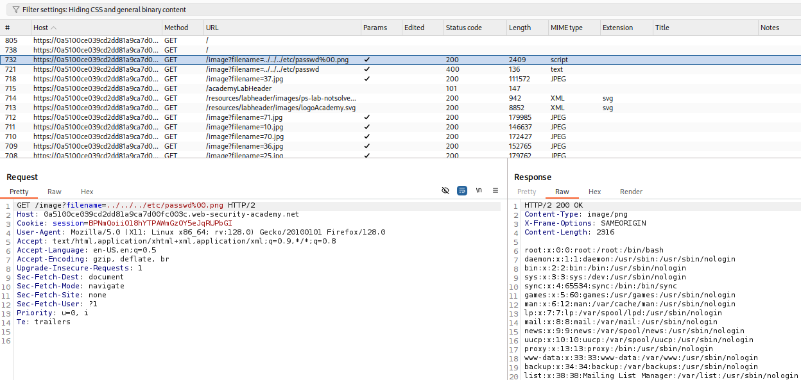

# Nom du lab: File path traversal, validation of file extension with null byte bypass

## URL : https://portswigger.net/web-security/file-path-traversal/lab-validate-file-extension-null-byte-bypass

### Les étapes de découverte de la vulnérabilité :

Récupération de la valeur du null byte '%00' sur le repo Github [Directory Traversal](https://github.com/swisskyrepo/PayloadsAllTheThings/tree/master/Directory%20Traversal)

Dans la requête de récupération d'une image, par exemple, GET /image?filename=71.jpg , on change la requête pour la suivante :
GET image?filename=../../../etc/passwd%00.png , ce qui va bypasser la vérification de l'extension attendue car '%00' simule une fin de string

#### Recommandations en terme de sécurité : 

